# Top 15 Online Banks Ranked in 2025 (Latest Update)

Picture this: your money sitting in a regular savings account, earning practically nothing while inflation nibbles away at its value. Now imagine that same money growing at ten times the rate, just by parking it somewhere smarter. That's the game online banks are playing these days, and honestly? They're winning.

Traditional banks with their fancy marble lobbies and endless paperwork feel almost quaint now. The new wave of digital-first institutions stripped away the overhead, passed the savings to customers, and suddenly everyone's grandmother is opening high-yield savings accounts on her phone. It's not revolutionary—it's just common sense wrapped in better technology.

What you're looking at here isn't another listicle churned out by someone who's never actually used these banks. This is a proper rundown of fifteen online banking platforms that actually deliver on their promises, starting with the ones offering the most value right now. No fluff, no affiliate garbage dressed up as advice. Just the straightforward truth about where your money can work hardest in 2025.

## **[CIT Bank](https://www.cit.com)**

An online division of First Citizens BancShares that's been quietly outperforming flashier competitors for years.

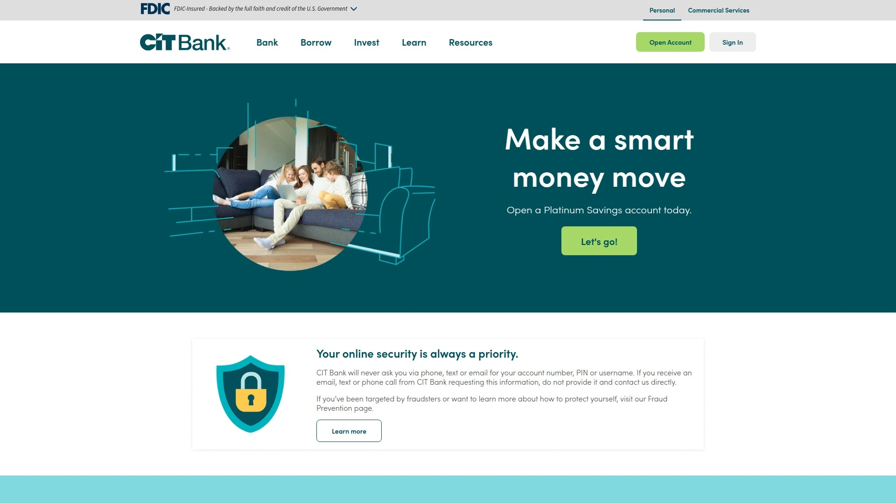

CIT Bank operates as a full-service digital banking platform under the First Citizens umbrella, bringing over a century of financial expertise into the modern age. What sets them apart is their multiple savings account tiers designed for different saving styles—whether you're just starting out or already sitting on a comfortable nest egg.

Their Platinum Savings account delivers a solid 3.85% APY, but only if you maintain at least $5,000 in the account. Below that threshold, the rate drops significantly. For folks who can't hit that minimum, the Savings Connect account offers nearly identical rates without the balance requirement, though you'll still need $100 to open it.

The Savings Builder account takes a different approach entirely—rewarding consistent savers who either maintain $25,000 or deposit at least $100 monthly. It's designed to encourage good habits rather than punish small balances.

Beyond savings, CIT offers an interest-earning checking account that pays up to 0.25% APY on balances over $25,000. You won't find many checking accounts earning anything these days, so that's worth noting. They've also got eight different CD terms ranging from six months to five years, though most fall below national averages except for their 13-month and 18-month options.

The mobile app pulls solid ratings across both platforms, and customers get up to $30 in ATM fee reimbursements monthly. No monthly maintenance fees on any account. No overdraft fees. No nonsense.

CIT shines brightest for methodical savers who appreciate having multiple account options under one roof and don't mind digital-only banking.

## **[Marcus by Goldman Sachs](https://www.marcus.com)**

Wall Street's retail banking experiment that actually worked out for regular people.

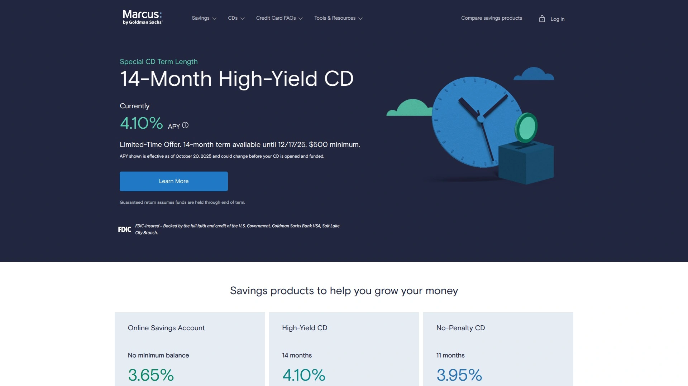

Marcus launched in 2016 as Goldman Sachs' first direct-to-consumer brand, bringing institutional-grade financial products to everyday savers. The operation is refreshingly simple—no checking accounts, no debit cards, just high-yield savings and CDs done extremely well.

Their Online Savings Account currently pays 3.65% APY with zero balance requirements and no monthly fees. You can open an account with literally any amount, and the rate stays consistent regardless of how much you deposit. Interest compounds daily, credited monthly.

What really distinguishes Marcus is their transfer system. Same-day online transfers up to $100,000 between your Marcus account and external banks, assuming your other institution processes quickly. For larger amounts, you'll need to call, but the $100,000 daily limit already exceeds most competitors. No Zelle integration though, which might matter if you're used to instant peer-to-peer payments.

The CD selection spans standard terms from six months to six years, all paying competitive rates without the balance gymnastics other banks require. Early withdrawal penalties exist but they're straightforward—90 days of interest for terms under two years, 180 days for longer terms.

Customer service operates 24/7 by phone and live chat. The mobile app scores consistently high ratings, though it lacks mobile check deposit functionality—you'll need to set up electronic transfers or mail physical checks.

Marcus ranked third in J.D. Power's 2025 Direct Banking Satisfaction Study, reflecting genuine customer approval rather than marketing spin. The bank keeps things deliberately uncomplicated, which either feels liberating or limiting depending on what you need from a bank.

Best suited for savers comfortable with digital-only banking who want competitive rates without account requirement headaches.

## **[Ally Bank](https://www.ally.com)**

The former GMAC reborn as an online banking powerhouse with legitimately useful features.

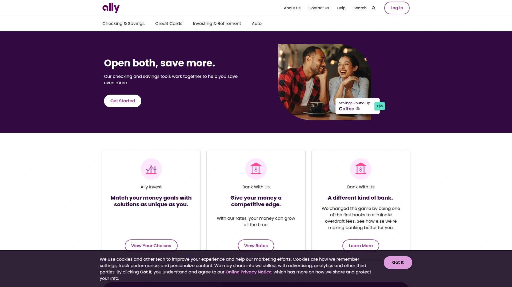

Ally transformed from an automotive finance company into one of America's largest online banks, now serving over eight million customers. Their approach prioritizes accessibility and transparency—no minimum deposits, no monthly fees, no fine print surprises.

The Online Savings Account pays 3.40% APY on all balances with absolutely zero requirements. Open it with a penny if you want. The checking account (they call it a Spending Account) also earns interest up to 0.25% APY depending on your balance, which beats the zero most checking accounts pay.

What makes Ally genuinely convenient is their Allpoint ATM network access—over 43,000 fee-free ATMs nationwide, plus they reimburse up to $10 per statement cycle for out-of-network ATM fees. For an online bank, that's exceptional cash access.

Their signature features include Savings Buckets (divvy your savings into up to 30 separate goals within one account) and Spending Buckets (track spending categories automatically). These organizational tools sound gimmicky until you actually use them, then they become indispensable for managing multiple financial goals simultaneously.

Ally Assist, their in-app banking expert, provides instant answers to account questions without navigating phone menus. The mobile app consistently earns 4.7+ stars across platforms with hundreds of thousands of ratings—not just high scores, but high scores at scale.

Early direct deposit gets you paid up to two days sooner. Overdraft protection through automatic transfers from savings costs nothing. Zelle integration for instant payments to friends and family.

Customer support runs 24/7 with actual humans answering calls, not just automated systems. They've won numerous "Best Online Bank" awards, but more importantly, they've maintained service quality while scaling to millions of customers.

Ally works for basically anyone seeking a full-service online banking experience without compromising on rates or features.

## **[Discover Bank](https://www.discover.com)**

The credit card company that quietly built one of the best online banking operations in America.

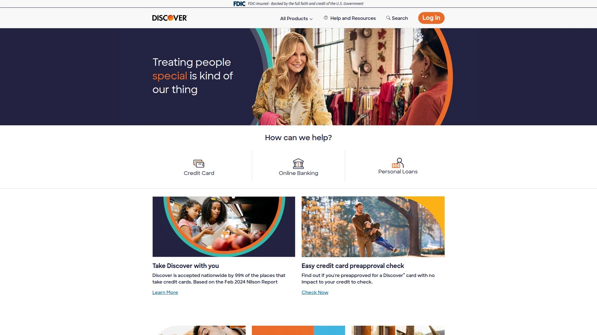

Discover Bank operates under the same brand known for cashback credit cards, leveraging decades of consumer financial experience into straightforward banking products. Their Online Savings Account pays 3.40% APY—matching many competitors while adding perks others skip.

No monthly fees. No minimum balance requirements. No minimum opening deposit. Interest compounds daily and posts monthly. The simplicity is the point.

Where Discover separates itself is account integration for existing cardholders. Link your Discover credit card and savings account, then redirect cashback rewards straight into savings where they continue earning interest. Most people cash out rewards immediately or leave them sitting as statement credits. Discover customers can turn rewards into compound growth instead.

The mobile app handles standard digital banking tasks smoothly—mobile check deposit, bill pay, account transfers, transaction history. Rated highly but not extraordinarily so. The website displays rates prominently without hunting through menu trees, and fee information lives right where you'd expect it.

Customer service availability is robust but not 24/7—phone support runs extended hours including Saturdays. For most people, that's sufficient.

Discover provides 60,000+ no-fee ATMs through their network. They also offer money market accounts, CDs, and checking accounts, making them a viable one-stop option for multiple banking needs.

The bank briefly ran savings bonus promotions offering $150-$200 for substantial deposits, though these aren't always available. Worth checking their current offers before opening.

Discover works particularly well for existing credit card customers who want seamless account integration, or for anyone seeking solid rates with brand-name reliability.

## **[American Express Personal Savings](https://www.americanexpress.com)**

The credit card giant's high-yield savings account that benefits from institutional strength and simplicity.

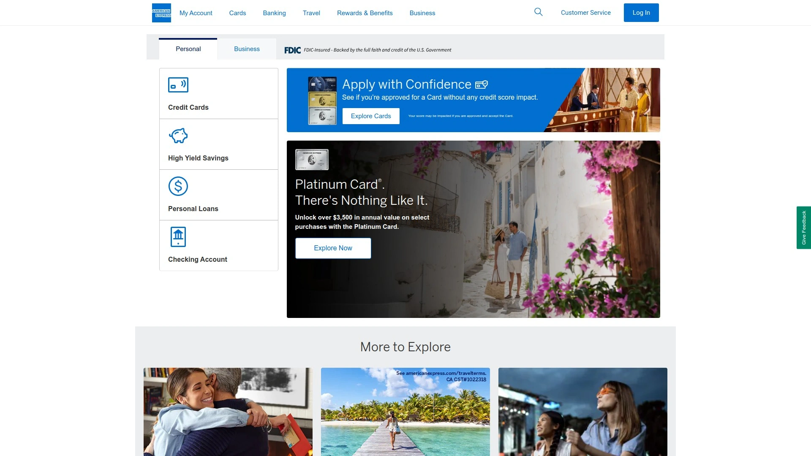

American Express National Bank launched its Personal Savings account to complement its credit card business, applying the same customer service standards to savings products. Currently offering 3.50% APY with zero minimum balance and no monthly fees.

The account keeps things deliberately straightforward—daily compounding interest, monthly crediting, unlimited ACH transfers to linked external accounts. You can fund via direct deposit, electronic transfer, or mobile check deposit (subject to limits of $25,000 per check and $50,000 daily).

Amex integrates savings directly into the same app and online platform used for their credit cards, creating unified account management. If you already carry an Amex card, adding the savings account feels seamless. If you don't, the app still functions cleanly for savings-only customers.

Security features include 128-bit encryption, two-factor authentication, and automatic logout. Customer support runs 24/7 with U.S.-based representatives consistently rated as responsive and helpful.

The notable limitation: no ATM or debit card access. All withdrawals happen through ACH transfers to external accounts. For a pure savings vehicle, this isn't necessarily a problem—it actually discourages impulsive withdrawals. But it means you'll need a separate checking account elsewhere for daily transactions.

Long-time customers report smooth, timely transfers and appreciate rate change notifications delivered through the app. The platform occasionally updates its interface, which some users find confusing temporarily, but generally the experience stays reliable.

American Express occasionally runs promotional bonuses for new accounts with substantial deposits—historically offering bonuses like $350 for maintaining $25,000 for several months. These aren't permanent offers, but worth watching for.

Best for people who value brand reliability and already use Amex products, or for dedicated savers who don't need ATM access and prefer keeping spending and savings firmly separated.

## **[Capital One 360 Performance Savings](https://www.capitalone.com)**

One of the first major banks to embrace online-only banking, still competitive a decade later.

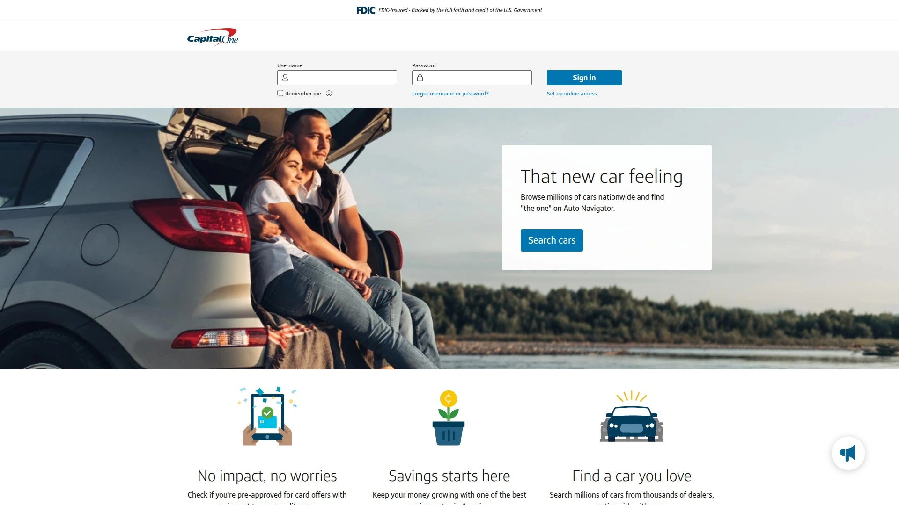

Capital One pioneered large-scale online banking back when most institutions still operated primarily through branches. Their 360 Performance Savings account delivers 3.40% APY with no monthly fees, no minimum balance requirements, and no minimum opening deposit.

The account opened over a decade ago and has consistently maintained competitive rates through multiple Federal Reserve cycles. While they're not always the absolute highest rate available, they reliably stay within the top tier without the volatility some newer institutions experience.

What distinguishes Capital One from pure-online competitors is their physical presence—you can actually visit Capital One Cafés or branches for face-to-face service if needed. This hybrid model appeals to people transitioning from traditional banking who want the safety net of in-person support occasionally.

Easy transfers between linked Capital One accounts or external banks. The mobile app handles typical functions competently—mobile check deposits, bill pay, account monitoring. Transfer money between savings and checking instantly when needed.

One interesting legal note: Capital One recently settled a class action lawsuit for $425 million related to interest rate differences between their 360 Savings and 360 Performance Savings accounts between 2019-2025. Eligible account holders receive compensation automatically, and current 360 Savings accounts will now earn rates at least twice the FDIC national average.

Account opening takes roughly five minutes online, by mobile app, or at physical locations. You'll need standard information: name, date of birth, address, Social Security number, employment details.

Capital One occasionally runs substantial promotional bonuses—historically offering up to $1,500 for depositing and maintaining $100,000 for 90 days. These promotions cycle in and out, but they've run them consistently over the years for customers willing to move significant funds.

Works well for people who want competitive rates with the option of branch access, or for those gradually transitioning from traditional banks to digital banking.

## **[Synchrony Bank](https://www.synchrony.com)**

The retail credit powerhouse offering legitimately competitive savings rates alongside its store cards.

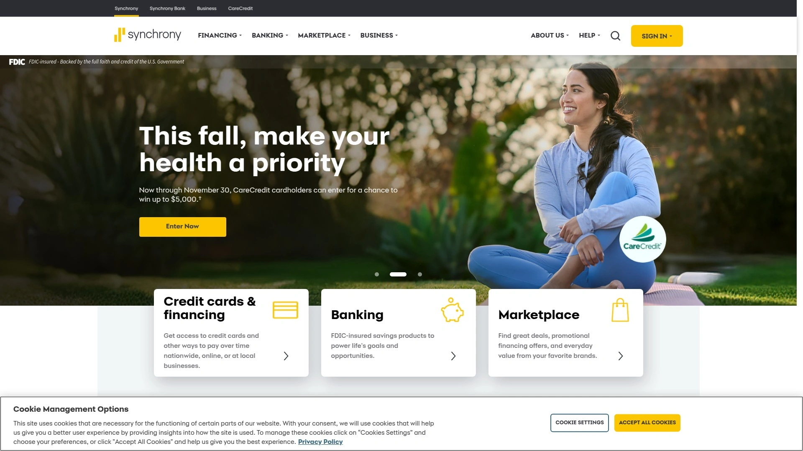

Synchrony operates primarily as a consumer financing provider for major retailers—Amazon, Lowe's, Sam's Club—but their direct banking division delivers surprisingly strong products. High Yield Savings currently pays 3.80% APY with no minimum balance requirement and no monthly fees.

Opening an account requires zero initial deposit. Interest compounds daily, credited monthly. Optional ATM card available for direct access to funds, plus reimbursement up to $5 per statement cycle for domestic ATM fees at other banks.

The bank offers Money Market Accounts earning 2.00% APY (also no minimums or fees) and CDs with terms from three months to five years, rates reaching 4.25% APY on some terms. They also provide IRA versions of both money market and CD accounts for retirement savings.

Synchrony's mobile app functions smoothly for basic banking—checking balances, transferring funds, depositing checks. Not groundbreaking, but reliable. Customer service available through multiple channels, though not 24/7.

The bank belongs to the Alliance Data/Bread Financial ecosystem, connecting 70 million active customer accounts across its various credit products. For some people, consolidating savings with an institution already managing their retail credit cards simplifies financial management.

Synchrony consistently appears in "best online bank" lists from major publications, recognized more for sustained competitive offerings than flashy promotions. They operate with lower volatility than some newer fintech banks, backed by decades of consumer finance experience.

Particularly suitable for customers already using Synchrony's retail credit products who want integrated account management, or for straightforward savers seeking solid rates without complexity.

## **[Barclays Online Savings](https://banking.us.barclays)**

British banking heritage meets American digital simplicity with consistently strong rates.

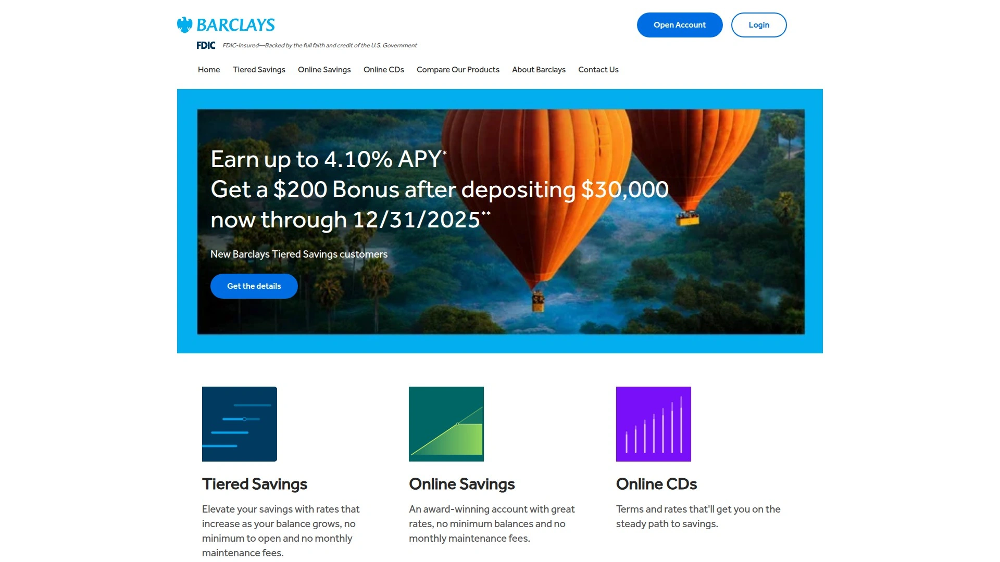

Barclays traces its roots to 1690 in London and introduced the world's first ATM. Their U.S. online banking division launched more recently, focusing exclusively on savings and CDs without the distraction of checking accounts or branch networks.

Online Savings currently pays 3.90% APY on all balances—no tiers, no minimum requirements, no monthly fees. Open an account with any amount. Interest compounds daily.

The bank provides two useful tools within their platform: Savings Assistant (helps calculate monthly savings needed for specific goals) and CD Calculator (projects returns across different terms). These aren't revolutionary features, but they're thoughtfully implemented and actually helpful for planning.

CD terms range from 12 to 60 months with competitive rates and no opening fees. Early withdrawal penalties apply—90 days of simple interest for terms under 24 months, 180 days for longer terms. Standard stuff, clearly disclosed.

No ATM withdrawals allowed, which isn't really a limitation for a savings-only account. Transfer funds electronically to external accounts when you need them. The Barclays app enables mobile check deposits, so you can add funds without leaving your couch.

Unlimited withdrawals and transfers from savings. Many banks still limit monthly transactions on savings accounts; Barclays doesn't.

Customer service availability isn't 24/7 but covers extended hours. The bank's website displays rates prominently and organizes information logically without marketing clutter.

Barclays occasionally offers account opening bonuses—historically up to $200 for new customers meeting deposit requirements. These rotate periodically.

Best for dedicated savers who appreciate transparent pricing from an established global institution and don't need checking or physical branch access.

## **[EverBank Performance Savings](https://www.everbank.com)**

Florida-based online bank delivering above-average rates with straightforward terms.

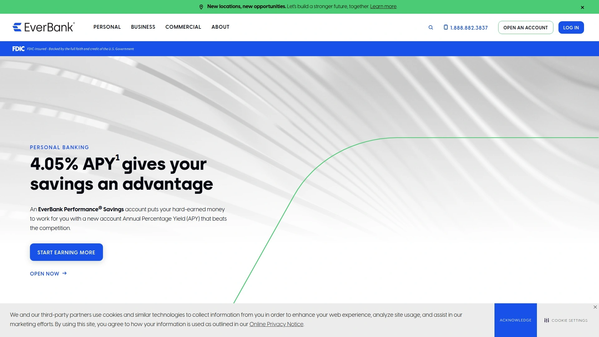

EverBank launched as TIAA Direct before rebranding, maintaining its focus on competitive savings rates and simple account structures. Performance Savings accounts currently offer 4.05% APY for new accounts—roughly eight times the national average.

No monthly maintenance fee. No minimum balance requirement. Zero dollars to open. Interest compounds daily. The rate is variable and applies to all balance levels equally.

The bank also offers Performance Checking (earning 0.25% APY on all balances), Performance Money Market (4.00% APY on balances $10,000+), and Performance CDs with terms from 3 months to 5 years. Their 7-month CD currently matches the savings account rate at 4.05% APY.

For accounts maintaining at least $5,000, EverBank provides unlimited ATM fee reimbursements nationwide. Below that balance, you get up to $15 monthly in reimbursements. Either way, they don't charge their own ATM fees.

Free online bill pay (expedited payments available for a fee). Debit card available on request for checking and money market accounts. Mobile and online platforms provide 24/7 account access.

All accounts are FDIC-insured to standard limits. The bank maintains solid ratings from independent evaluators, reflecting financial stability rather than startup volatility.

EverBank partners with athlete Trevor Lawrence as a brand ambassador, emphasizing performance and community engagement. Whether that matters depends on how much you care about bank marketing, but it reflects their positioning as a competitive, achievement-focused institution.

Application process happens exclusively online or by phone. Account opening typically takes minutes with standard information—identification, Social Security number, address, employment details.

Works particularly well for savers seeking genuinely competitive rates from an established institution rather than a fintech startup, especially valuable for those who might want checking or money market options later.

## **[SoFi Checking and Savings](https://www.sofi.com)**

Former student loan refinancer turned full-service digital bank with uniquely integrated products.

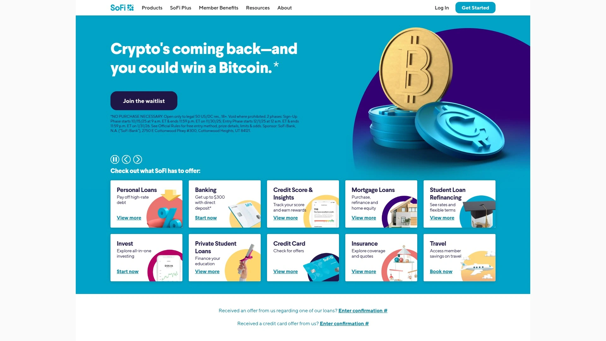

SoFi began refinancing student loans before expanding into personal loans, investing, and eventually banking. Their Checking and Savings account combines both functions into one integrated product—unusual among online banks.

The savings component pays 3.80% APY with no minimum balance, while checking earns 0.50% APY. You don't need to meet savings requirements to earn the checking rate, but you do need at least $1,000 monthly direct deposit to qualify for overdraft coverage.

Early paycheck access delivers direct deposits up to two days before official payday. Tens of thousands of Allpoint ATMs available fee-free for withdrawals. The account charges zero monthly fees, no overdraft fees (with qualifying direct deposits), and no minimum balance requirements.

Cash deposits cost $4.95 per transaction through Green Dot retail locations (7-Eleven, CVS, Walgreens, Walmart). That's notably expensive compared to banks offering free cash deposits, so SoFi works best for people who rarely handle physical cash.

The mobile app integrates all SoFi products—banking, investing, loans, insurance—into one interface. For customers using multiple SoFi services, this creates genuinely convenient financial management. For banking-only users, it's just a well-designed app.

SoFi occasionally offers account opening bonuses—historically up to $300 for new customers setting up direct deposit. These promotions cycle regularly.

No physical branches anywhere. Customer support operates through digital channels with generally positive reviews, though experiences vary.

Best for younger professionals or existing SoFi customers who want consolidated financial services in one app, particularly valuable for those with steady direct deposit income who rarely use cash.

## **[UFB Direct Portfolio Savings](https://www.ufbdirect.com)**

Division of Axos Bank specializing in high-yield savings with enhanced APY opportunities.

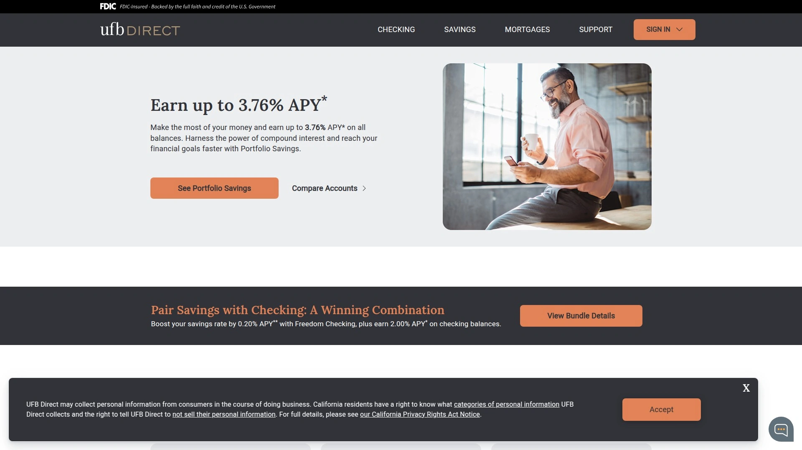

UFB Direct operates as a division of Axos Bank, focusing exclusively on online banking products without physical branches. Portfolio Savings pays 3.76% APY on all balances with no minimums and no monthly fees.

The unique angle: link a UFB Freedom Checking account and meet specific criteria to earn up to 0.20% additional APY on your savings. Requirements include $5,000+ monthly direct deposits, maintaining $10,000 minimum daily checking balance, and making at least ten debit transactions over $3 monthly. Meeting all three bumps savings to 3.96% APY.

Those requirements are genuinely demanding—most people won't hit all three consistently. But for those who do, the boosted rate beats many standalone competitors.

The savings account comes with an ATM card—unusual for pure savings products—enabling free cash withdrawals at over 91,000 ATMs nationwide. Incoming wire transfers cost nothing. Paper statements cost $5, which incentivizes going paperless.

Mobile app scores highly (4.8 on App Store, 4.7 on Google Play) but has fewer total reviews than banking giants. Features include mobile check deposit, online bill pay, account alerts, and SMS banking.

Money market and checking options available if you want to expand your relationship with UFB. The checking account itself doesn't earn interest but serves primarily to unlock that savings APY boost.

UFB periodically relaunches or rebrands accounts, which sometimes confuses existing customers. The core products remain stable, but naming conventions occasionally shift.

Customer service available 24/7 by phone, plus comprehensive online support.

Particularly suitable for customers willing to meet checking account requirements to maximize savings rates, or for straightforward savers who appreciate ATM card access on their savings account.

## **[Bask Bank Interest Savings](https://baskbank.com)**

Texas Capital Bank's online division offering standout rates and an unusual airline miles option.

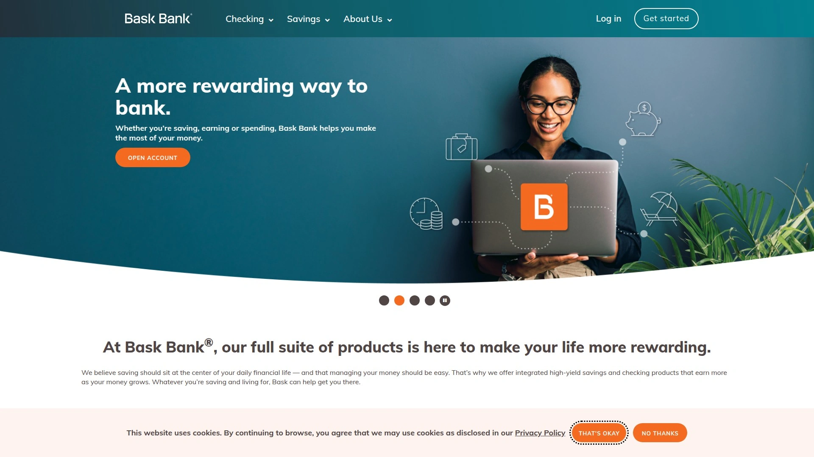

Bask Bank launched as the digital arm of Texas Capital Bank in 1999, claiming the title of America's first exclusively online savings institution. Their Interest Savings Account currently pays 4.05% APY with no monthly fees and no minimum balance requirement.

What makes Bask genuinely distinctive is their Mileage Savings Account—instead of earning interest, you earn 1.75 American Airlines AAdvantage miles per dollar saved annually. For frequent flyers or mileage collectors, this creates an alternative value proposition. Calculate whether miles or interest benefits you more based on your travel patterns.

Interest compounds daily, credited monthly. Minimum opening deposit of $100 required, with account funding due within 15 business days of opening.

No ATM or debit cards available. All transactions happen electronically through ACH transfers or wire transfers. This savings-focused design actually helps maintain discipline—you're not carrying a card that makes impulsive withdrawals easy.

Bask also offers standard CDs with terms from 3 to 24 months, rates reaching 4.05% APY on 6-month terms. Minimum $1,000 deposit required for CDs.

The bank operates entirely online with customer support through digital channels and phone. Mobile app functionality covers basic banking needs competently without excessive features.

Bask occasionally appears near the top of high-yield savings rankings in major publications. Rates have remained competitive consistently rather than spiking temporarily for promotional purposes.

Best for straightforward savers wanting strong rates from an established bank, or for American Airlines loyalists who'd rather accumulate miles than earn interest.

## **[Varo Bank Savings Account](https://www.varomoney.com)**

Mobile-first neobank offering one of the highest potential APYs in America—with conditions.

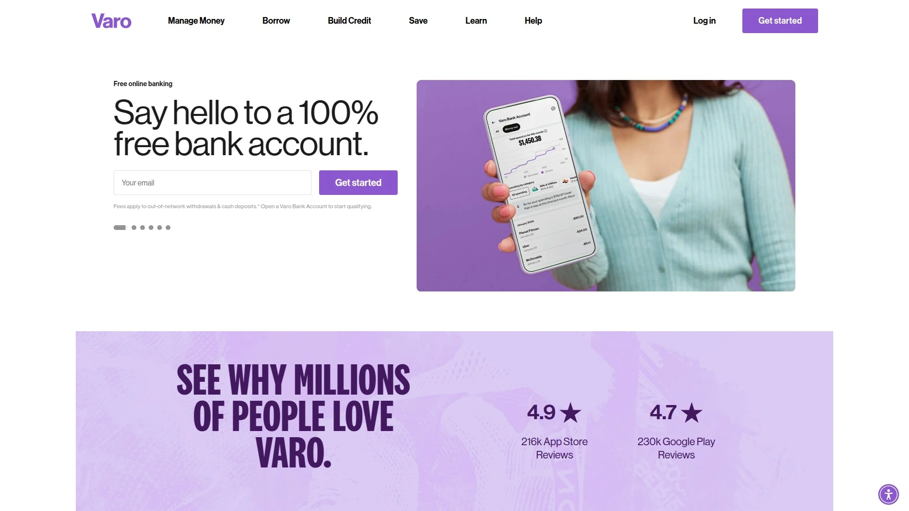

Varo received a national bank charter in 2020, becoming the first consumer fintech to achieve full bank status rather than operating through bank partnerships. Their savings account pays up to 5.00% APY on balances up to $5,000, with 2.50% APY on amounts above that.

Here's the catch: earning that 5.00% requires opening both a Varo Bank Account (checking) and Savings Account, receiving at least $1,000 monthly in direct deposits, and maintaining positive balances in both accounts at month-end. Meet those requirements and you qualify for the top rate the following month. Miss them and you earn the standard 2.50% rate.

For people with steady paychecks deposited electronically, these requirements are manageable. For irregular income earners or those preferring manual transfers, they're obstacles.

No minimum opening deposit. No monthly fees. No minimum balance requirements beyond needing positive balances to qualify for the higher APY.

The platform includes automatic savings tools: Save Your Pay (automatically transfer portions of direct deposits to savings) and Save Your Change (round up purchases to the nearest dollar, transferring the difference). These features help consistent saving without requiring manual effort.

Varo also offers Varo Cash Advance (borrow $250-$500 quickly, with flat fees rather than interest), Varo Believe (secured credit card for building credit without annual fees), and Column Tax (free tax filing with direct deposit to Varo).

Early direct deposit arrives up to two days before official payday. Sign up takes under two minutes with no credit check required.

The mobile app drives the entire experience—Varo operates without physical branches or even a traditional website banking portal. Everything happens in the app.

Best for mobile-savvy customers with steady direct deposit income who can consistently meet requirements, particularly valuable for those building emergency funds or short-term savings goals.

## **[Axos Bank Summit Savings](https://www.axosbank.com)**

California fintech with decades of digital banking experience offering straightforward high-yield savings.

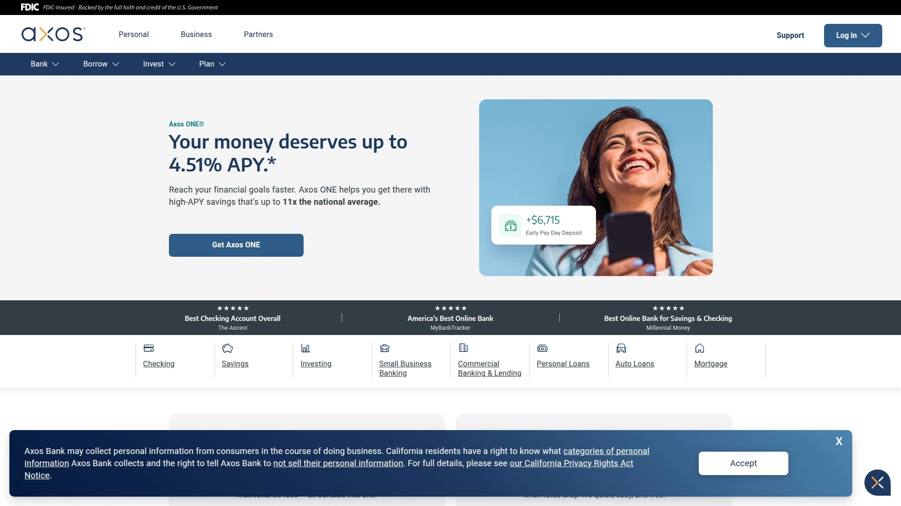

Axos Bank operates entirely online with over 400,000 customers and more than $20 billion in assets. Summit Savings delivers 4.00% APY on all balances with no minimum balance requirement for that rate, no monthly maintenance fees, and no minimum initial deposit.

The account provides standard digital conveniences—easy mobile check deposit, 24/7 online and mobile access, free incoming wire transfers. Access to 95,000+ fee-free ATMs nationwide, among the largest networks available.

Interest rates are variable and may change without notice. The 3.92% interest rate compounds to produce the 4.00% APY through daily compounding.

Axos also offers the Axos ONE bundle combining checking and savings with boosted rates—up to 4.51% APY on savings and 0.51% on checking when meeting monthly requirements. Requirements include monthly deposits, debit card usage, and maintaining minimum balances. For customers willing to optimize their banking behavior, ONE delivers higher returns. For straightforward savers, Summit Savings provides solid rates without homework.

The bank provides access to expanded FDIC insurance up to $265 million through IntraFi Network Deposits for high-net-worth customers who need coverage beyond standard $250,000 limits.

Mobile app rates 4.7 stars on Apple's App Store. Evo, their 24/7 virtual assistant, handles common questions, with human customer service available for complex issues.

No monthly maintenance, minimum balance, or account opening fees. No overdraft fees. The fee structure genuinely minimizes nickel-and-diming.

Early payday feature delivers direct deposits up to two days early. Link external accounts within the app for seamless money movement.

Particularly suitable for tech-comfortable savers wanting competitive rates without unnecessary complications, or for high-net-worth individuals needing expanded FDIC coverage.

## **[LendingClub LevelUp Savings](https://www.lendingclub.com)**

Peer-to-peer lending pioneer turned full-service bank with a unique deposit-reward structure.

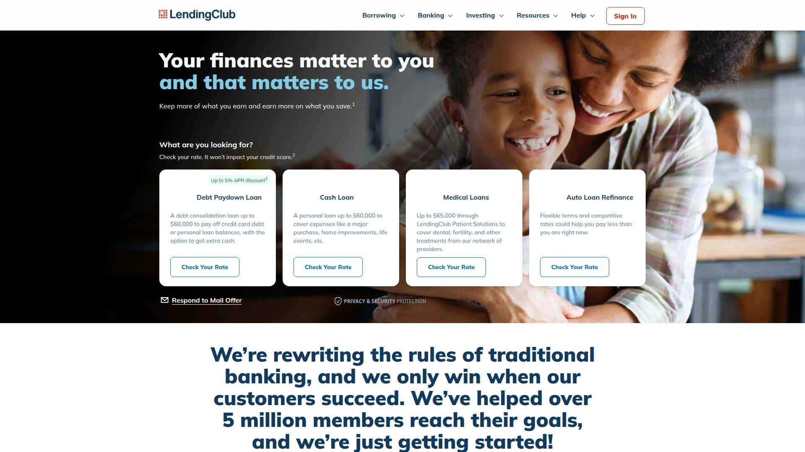

LendingClub originated as a peer-to-peer lending marketplace before acquiring Radius Bank in 2020 and transforming into a regulated bank. Their LevelUp Savings account pays 4.20% APY—but only if you deposit at least $250 per statement cycle.

Make those $250+ monthly deposits and you earn the LevelUp Rate of 4.20% APY. Miss a month and you drop to the Standard Rate of 3.20% APY the following month. Interest payments, account bonuses, and refunds don't count toward the $250 requirement—it must be actual new deposits.

The structure rewards consistent savers who regularly add money rather than those maintaining static balances. If you're building savings actively, LendingClub works well. If you've already accumulated a nest egg and just want to park it, the conditional rate structure becomes annoying.

No monthly fees. Zero minimum opening deposit. Optional ATM card for quick access to funds. Interest compounds daily on the Standard Rate, though the LevelUp Rate calculation uses different methodology.

For the first three months after opening, you automatically earn the LevelUp Rate to provide time for setting up deposits. The evaluation period begins in month three.

Mobile app integrates banking with LendingClub's other financial products. Customer support available through chat, phone, and email, though not 24/7.

LendingClub also offers a High-Yield Savings account paying 3.70% APY with no deposit requirements. For people who dislike conditional rates, this provides an alternative within the same institution.

Best for active savers regularly contributing to savings who appreciate being rewarded for consistent deposits, less ideal for passive savers maintaining existing balances.

## Where does your money actually belong?

Here's the thing nobody says out loud: most of these banks are genuinely good. The differences often matter less than the simple act of moving your money out of that 0.01% traditional savings account collecting dust.

CIT Bank sits at the top here because they combine institutional stability with multiple account options that fit different saving styles. But Marcus offers cleaner simplicity. Ally delivers better overall banking features. Discover integrates beautifully with their credit cards. And Varo pays the highest rate if you can meet the requirements.

The best bank isn't universal—it's whichever one matches how you actually use money. Do you maintain large steady balances? Look at accounts rewarding that. Building savings gradually? Focus on ones rewarding deposits. Want your banking in one place? Choose platforms offering checking, savings, and CDs together. Need occasional cash deposits? Skip pure digital banks without retail partnerships.

Take fifteen minutes to open a [CIT Bank](https://www.cit.com) account and move some money there. See how it feels. You're not marrying the bank—you're testing whether better rates actually matter in practice versus theory. Most people discover that yes, watching money grow at 3-4% instead of effectively zero is surprisingly motivating.

The best decision is simply making one at all.

## Common Questions People Actually Ask

**What happens if these online banks fail?**

FDIC insurance covers up to $250,000 per depositor, per institution, per ownership category—same protection as traditional banks. These aren't startups operating in regulatory gray zones; they're actual banks or divisions of major banking institutions. CIT is owned by First Citizens, Marcus is Goldman Sachs, American Express is, well, American Express. They fail at roughly the same nonexistent rate as branch banks.

**How fast can you access your money?**

Standard ACH transfers take 1-3 business days between online banks and external accounts. Most institutions offer expedited transfers for urgent situations, sometimes on the same day for amounts under certain thresholds. Several banks (Ally, Varo, Axos) provide ATM cards for immediate cash access. Not quite as instant as walking into a branch, but faster than people expect.

**Do rates actually stay competitive long-term?**

Rates fluctuate with Federal Reserve policy, but established online banks generally maintain their competitive position relative to the market. Marcus and Ally have delivered above-average rates consistently for years, not just during promotional periods. Smaller or newer institutions sometimes offer temporarily inflated rates that drop later, but the banks listed here show more stability.
